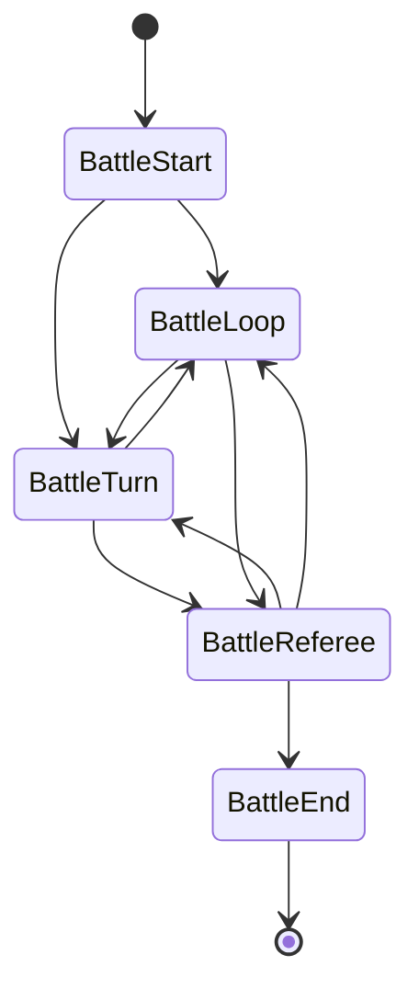

Every match in Beast Card Clash is driven by a five-phase **finite state machine** (FSM). Rather than a monolithic battle script, each phase of the game — setup, bot turns, the human turn, scoring, and the results screen — is encapsulated in its own `BattleState` class. The `BattleManager` node owns the current state and triggers transitions.

This design makes each phase independently testable and easy to extend without touching unrelated logic.

## State diagram



## Class hierarchy

All battle states share a common base. The inheritance chain is:

```
Node
└── BaseState
    └── BattleState
        ├── BattleStart
        ├── BattleLoop
        ├── BattleTurn
        ├── BattleReferee
        └── BattleEnd
```

`BaseState` is a generic state base that provides a `controlled_node` property. `BattleState` specialises it with a typed `manager` property that gives every state direct access to the `BattleManager`:

```gdscript
class_name BattleState extends BaseState

var manager: BattleManager:
    set(value):
        controlled_node = value
    get:
        return controlled_node
```

This means any state can reach shared battle data and trigger transitions through `manager` without coupling states to each other.

## The five states

<AccordionGroup>
  <Accordion title="BattleStart — setup" defaultOpen={true}>
    **File:** `assets/battle/states/start.gd`

    `BattleStart` runs once at the beginning of every match. Its job is to build
    the initial game world before any player or bot acts.

    **Responsibilities:**

    - Calls `MusicManager.play_music("battle")` to start the battle music
    - Calls `manager.setup_player()` — creates the human player from `PlayerStats`, builds their deck
    - Calls `manager.setup_bots()` — creates 1–3 bots with random decks, shuffles turn order
    - Calls `manager.setup_ui()` — refreshes player stats panel, seeds hand display, hides end UI
    - Calls `manager.setup_world()` — disables dice via `BattleWorld`

    **Transitions:**

    | Condition                  | Next state    |
    | -------------------------- | ------------- |
    | Human player goes first    | `BattleTurn`  |
    | A bot goes first           | `BattleLoop`  |
  </Accordion>

  <Accordion title="BattleLoop — bot turns">
    **File:** `assets/battle/states/loop.gd`

    `BattleLoop` handles all automated (bot) turns. It runs without player
    interaction and loops until it is the human's turn or the round ends.

    **Responsibilities:**

    - Determines whose turn is next in the turn order
    - Rolls the dice for the active bot
    - Selects a rock for the bot to move to
    - Chooses a card from the bot's hand and plays it
    - Advances the turn counter

    **Transitions:**

    | Condition                        | Next state       |
    | -------------------------------- | ---------------- |
    | Next in turn order is a bot      | Stays in `BattleLoop` (loops) |
    | Next in turn order is the human  | `BattleTurn`     |
    | No turns remain in the round     | `BattleReferee`  |
  </Accordion>

  <Accordion title="BattleTurn — human turn">
    **File:** `assets/battle/states/turn.gd`

    `BattleTurn` is the interactive phase where the human player takes their
    action. The scene waits for input at each step.

    **Responsibilities:**

    - Enables the 3D dice — the player clicks it to roll
    - Highlights valid rock positions based on the dice result
    - Moves the player character to the chosen rock
    - Reveals the player's hand and enables card selection
    - Plays the selected card
    - Passes the turn when the card has been played

    **Transitions:**

    | Condition                        | Next state       |
    | -------------------------------- | ---------------- |
    | Next in turn order is a bot      | `BattleLoop`     |
    | Next in turn order is the human  | Stays in `BattleTurn` |
    | No turns remain in the round     | `BattleReferee`  |

    <Tip>
      The turn-passing logic uses the same criteria in both `BattleTurn` and
      `BattleLoop`. Any changes to turn order rules must be applied consistently
      in both states.
    </Tip>
  </Accordion>

  <Accordion title="BattleReferee — round resolution">
    **File:** `assets/battle/states/referee.gd`

    `BattleReferee` runs after all players have taken their turns in a round.
    It evaluates the cards played, applies damage, and decides whether the match
    continues.

    **Responsibilities:**

    - Collects every card played during the round
    - Compares cards according to elemental rules and card values
    - Applies damage to the appropriate players
    - Removes defeated players (those whose health reaches zero)
    - Determines whether the match should continue

    **Transitions:**

    | Condition                             | Next state    |
    | ------------------------------------- | ------------- |
    | 2 or more players remain, new round   | `BattleLoop` or `BattleStart` (re-setup) |
    | Only 1 player remains                 | `BattleEnd`   |

    See [Battle mechanics](/mechanics/battle) for the card comparison rules that
    this state enforces.
  </Accordion>

  <Accordion title="BattleEnd — results">
    **File:** `assets/battle/states/end.gd`

    `BattleEnd` is the terminal state. It runs once after `BattleReferee`
    determines a winner.

    **Responsibilities:**

    - Calculates the final player ranking based on elimination order
    - Displays the end screen with results (winner, placements)
    - Waits for the player to press the back button

    **Transitions:**

    | Condition                        | Next state       |
    | -------------------------------- | ---------------- |
    | Player presses back / exit       | Returns to start menu via `SceneManager` |
  </Accordion>
</AccordionGroup>

## How BattleManager drives transitions

The `BattleManager` node holds a reference to the current active state. States do not transition themselves — they call a method on `manager` to request a transition, passing the name or reference of the next state. This keeps the state graph easy to audit in one place.

```gdscript
# Example: requesting a transition from inside a state
manager.transition_to(manager.state_loop)
```

See [Battle manager](/dev/battle-manager) for the full implementation details.

## Adding a new state

Follow these steps to introduce a new phase to the battle:

<Steps>
  <Step title="Create the state script">
    Add a new GDScript file under `assets/battle/states/`. Extend `BattleState`
    and implement the `enter()`, `exit()`, and `update()` methods inherited from
    `BaseState`.

    ```gdscript
    class_name BattleMyPhase extends BattleState

    func enter() -> void:
        # Called when this state becomes active
        pass

    func exit() -> void:
        # Called just before leaving this state
        pass
    ```
  </Step>

  <Step title="Register the state in BattleManager">
    Open `assets/battle/battle_manager.gd` (or the scene file) and add your new
    state as a child node or an exported variable, following the same pattern as
    the existing five states.
  </Step>

  <Step title="Define the transitions">
    In the states that should lead to your new state, add a call to
    `manager.transition_to(manager.state_my_phase)` at the appropriate point.
    Update any state that your new state should transition to as well.
  </Step>

  <Step title="Update the diagram">
    Keep the state diagram in `.docs/` (and on this page) in sync with the new
    transition edges so the next developer has an accurate map.
  </Step>
</Steps>

## Related pages

<Columns cols={2}>
  <Card title="Battle manager" icon="sword" href="/dev/battle-manager">
    The node that owns the state machine and drives transitions between states.
  </Card>
  <Card title="Battle mechanics" icon="shield" href="/mechanics/battle">
    Player-facing rules that the Referee state enforces.
  </Card>
  <Card title="Architecture overview" icon="layout-dashboard" href="/dev/overview">
    How the state machine fits into the broader codebase design.
  </Card>
  <Card title="Card system" icon="cards-blank" href="/dev/card-system">
    How cards are defined and what data the Referee state reads.
  </Card>
</Columns>
