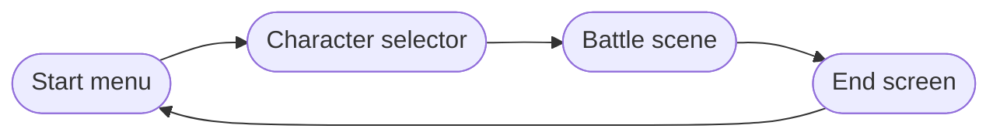

Beast Card Clash is built in **Godot 4.6** with GDScript as the primary language. The codebase is organized around a small set of well-defined design patterns that keep game logic, UI, and data cleanly separated. This page gives you a map of the project so you know where everything lives before diving into individual systems.

## Project structure

```text
beast_card_clash/
├── addons/                    # Godot plugins
│   ├── dialogue_manager/      # Third-party dialogue system
│   └── vector_display_2d/     # Vector rendering helper
├── assets/
│   ├── battle/                # Battle scene, states, UI, dice, rocks, player
│   ├── cards/                 # Card scene, CardsList resource
│   ├── character_selector/    # Character, skin, and team selection UI
│   ├── characters/            # Character models
│   ├── dialogues/             # .dialogue files (begin, lose, pregame, win)
│   ├── elements/              # Element assets
│   ├── fonts/
│   ├── models/
│   ├── music/
│   ├── shaders/               # GDShader visual effects
│   ├── teams/                 # Team data resources
│   ├── tests/                 # Test assets
│   └── ui/                    # Start menu, tutorial, credits, back button
├── autoload/
│   ├── game_constants.gd      # GameConstants singleton
│   ├── scene_manager.gd       # SceneManager singleton
│   ├── music_manager.gd       # MusicManager singleton
│   ├── flags_manager.gd       # FlagsManager singleton
│   ├── player_stats.gd        # PlayerStats singleton
│   └── resources/             # AutoloadResource, Flags, Playlist scripts
├── .ai_docs/                  # AI-generated per-file documentation
├── .docs/                     # Hand-written docs and diagrams
├── project.godot
├── CONTRIBUTING.md
└── README.md
```

## Tech stack

<Columns cols={2}>
  <Card title="Godot 4.6" icon="gamepad-2">
    The game engine. Provides the scene tree, signals, physics, and built-in UI
    nodes that everything else builds on.
  </Card>
  <Card title="GDScript" icon="code">
    Primary language for all gameplay logic, autoloads, UI scripts, and state
    machine states (390 KB of source).
  </Card>
  <Card title="C#" icon="hashtag">
    Used for select systems via optional .NET 8 integration (29 KB). Not required
    to run the game.
  </Card>
  <Card title="GDShader" icon="wand-magic-sparkles">
    Custom shaders for visual effects in `assets/shaders/`.
  </Card>
  <Card title="Dialogue Manager" icon="message-square">
    Third-party Godot plugin (`addons/dialogue_manager`) that drives all
    in-game narrative and cutscenes.
  </Card>
  <Card title="Python & Shell" icon="terminal">
    Tooling and automation scripts. Not part of the game runtime.
  </Card>
</Columns>

## Core design patterns

### Autoloads as singletons

Godot autoloads are nodes that Godot instantiates once and makes available to every other scene by name. Beast Card Clash uses six autoloads to expose global state and services without coupling scenes to each other.

```gdscript
# Any script can access autoloads directly by their registered name
var team := GameConstants.Teams.ADN
PlayerStats.skin = "andean"
SceneManager.change_to_scene("battle")
MusicManager.play_music("battle_theme")
```

See [Autoloads & Singletons](/dev/autoloads) for the full API reference of each autoload.

### State machine for battle flow

The battle scene is driven by a five-phase state machine: **Start → Loop → Turn → Referee → End**. Each phase is a separate GDScript class that extends `BattleState`, which itself extends a generic `BaseState`. The `BattleManager` node owns the active state and drives transitions.

This pattern keeps each phase's logic isolated and easy to extend without touching the others. See [Battle state machine](/dev/battle-state-machine) for the full diagram and state descriptions.

### Resource-based data

Game data (cards, teams, playlists, flags, scenes) is stored as Godot `Resource` files rather than hardcoded in scripts. Autoloads load these resources at startup and expose typed accessors. This makes it straightforward to add new cards, teams, or tracks without modifying logic code.

```gdscript
# Example: AutoloadResource pattern used by MusicManager and SceneManager
func get_item(name: String) -> Resource:
    return _items[name]
```

### Signal-based UI updates

UI nodes do not poll game state each frame. Instead, game logic emits Godot signals and UI nodes connect to them. This keeps the battle scene responsive and avoids tight coupling between the state machine and the HUD.

## How scenes connect

The game's scene flow is linear and controlled entirely through `SceneManager`:



1. **Start menu** — the entry point. Launches character/team selection or shows credits and the tutorial.
2. **Character selector** — the player picks a team, species, and skin. This writes to `PlayerStats`.
3. **Battle scene** — the core gameplay loop, driven by the battle state machine. `BattleStart` calls `setup_player()`, `setup_bots()`, `setup_ui()`, and `setup_world()` on the `BattleManager`.
4. **End screen** — shown from the `BattleEnd` state after ranking is determined. The back button returns to the start menu via `SceneManager`.

<Note>
  All scene transitions use `SceneManager.change_to_scene(name)`. You should never
  call `get_tree().change_scene_to_*` directly in scene scripts.
</Note>

## Explore further

<Columns cols={3}>
  <Card title="Autoloads & singletons" icon="database" href="/dev/autoloads">
    Full API reference for all six globally accessible autoload nodes.
  </Card>
  <Card title="Battle state machine" icon="diagram-project" href="/dev/battle-state-machine">
    How the five-phase state machine controls every match from start to finish.
  </Card>
  <Card title="Battle manager" icon="sword" href="/dev/battle-manager">
    The node that owns and drives the state machine during a battle.
  </Card>
  <Card title="Card system" icon="cards-blank" href="/dev/card-system">
    How cards are defined, stored, and played.
  </Card>
  <Card title="Battle mechanics" icon="shield" href="/mechanics/battle">
    Player-facing rules for how battles resolve.
  </Card>
  <Card title="Contributing" icon="git-pull-request" href="/dev/contributing">
    How to set up your dev environment and submit changes.
  </Card>
</Columns>
