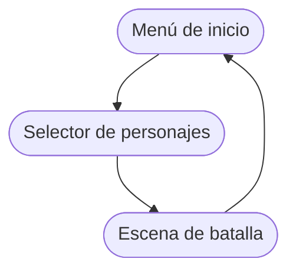

Beast Card Clash está desarrollado en Godot 4.6 con GDScript como lenguaje principal. El código está organizado en torno a un pequeño conjunto de patrones de diseño bien definidos que mantienen la lógica del juego, la interfaz de usuario y los datos claramente separados. Esta página te ofrece una visión general del proyecto para que sepas dónde se encuentra cada elemento antes de profundizar en los sistemas individuales.

## Estructura del proyecto

La estructura del proyecto sigue un enfoque por **cercanía** en el cual las escenas se organizan en carpetas junto a sus recursos y los recursos compartidos se separan. Este enfoque es más sencillo de mantener y es recomendado por Godot para proyectos medianos a grandes.

```text
beast_card_clash/
├── addons/                    # Plugins
│   ├── dialogue_manager/
│   └── vector_display_2d/
├── assets/
│   ├── battle/                # Escenario de batalla
│   ├── cards/                 # Cartas
│   ├── character_selector/    # Selector de personajes
│   ├── dialogues/             # Archivos de diálogos
│   ├── elements/              # Elementos (íconos)
│   ├── fonts/                 # Fuentes
│   ├── music/                 # Banda sonora y efectos de sonido
│   ├── shaders/               # Shaders
│   ├── teams/                 # Información sobre los equipos
│   └── ui/                    # Start menu, tutorial, credits, back button
├── autoload/                   
├── tests/                     # Elementos de prueba
├── .docs/                     # Documentación a mano
├── project.godot
├── CONTRIBUTING.md
└── README.md
```

## Herramientas

<Columns cols={2}>
  <Card title="Godot 4.6" color="#3b51f3" icon="robot">
    Usamos Godot 4 lo más actualizado posible, aunque es probable que no se pueda migrar al 5.
  </Card>

  <Card title="GDScript" color="#2a98ff" icon="code">
    Lenguaje principal para toda la lógica del juego. Te recomendamos seguirlo usando para cualquier adición.
  </Card>

  <Card title="C#" color="#168128" icon="hashtag">
    Para addons que contienen C# y probablemente para procesamiento de datos en el futuro. Basado en .NET 8 o superior.
  </Card>

  <Card title="GDShader" color="#28ffbf" icon="cube">
    Efectos visuales varios para el juego. Todos en `assets/shaders/`.
  </Card>

  <Card title="Dialogue Manager" color="#a33eea" icon="thought-bubble">
    Plugin externo de Nathan Hoad (`addons/dialogue_manager`) elegido para los diálogos del juego.
  </Card>
</Columns>

## Elecciones de diseño

### Autoloads como singletons

Los autoloads de Godot son nodos que Godot instancia una sola vez y pone a disposición de todas las demás escenas por su nombre. Beast Card Clash los usa para exponer el estado global y los servicios sin que las escenas dependan unas de otras.

```gdscript
# Accesibles donde sea
var team := GameConstants.Teams.ADN
PlayerStats.skin = "andean"
SceneManager.change_to_scene("battle")
MusicManager.play_music("battle_theme")
```

Mira [Autoloads & Singletons](/dev/autoloads) para conocer la API completa de cada autoload.

### Flujo de batalla

Las batallas se controlan con una máquina de estados de cinco pasos:

1. `Start`: Inicio de batalla
2. `Loop`: Ciclo de turnos para los bots
3. `Turn`: Turno del humano
4. `Referee`: Evaluación de las jugadas antes de acabar turno
5. `End`: Fin del juego

Cada una es una clase GDScript que extiende `BattleState` y a su vez `BaseState`. Un nodo `BattleManager` gestiona todos los estados.

Esto aisla la lógica de cada estado y lo permite extender de maneras más sencillas. Mira [Battle state machine](/dev/battle-state-machine) para más detalles del sistema.

### Uso de Resource

Los datos del juego se almacenan en recursos de Godot (`Resource`). Con los autoloads se pueden acceder a algunos. Esto mantiene un desacoplamiento más adecuado.

### Actualizaciones de UI basadas en señales

Como es típico en Godot, las interfaces de usuario se basan en señales para enviarse información entre sí. Aunque debemos mejorar la forma en la que viaja la información, que actualmente es un poco enredada.

## Estructura de las escenas

Gestionado con `SceneManager`, las escenas siguientes se conectan y fluyen entre sí:



1. **Menú de inicio:** El punto de inicio.
2. **Selector de personajes:** El jugador elige especie, color, equipo y nombre. Todo se escribe en`PlayerStats`.
3. **Escena de batalla:** Con toda la lógica principal. Es la única parte más o menos completa del juego.

También hay otros menús como los créditos, tutorial o fin de juego (en Batalla)

## Ver más

<Columns cols={3}>
  <Card title="Autoloads y singletons" icon="database" href="/dev/autoloads">
    Referencia de uso de los autoloads del juego.
  </Card>

  <Card title="Batalla" icon="diagram-project" href="/dev/battle-state-machine">
    Como funciona la SFM de batalla.
  </Card>

  <Card title="BattleManager" icon="sword" href="/dev/battle-manager">
    El nodo principal de la batalla.
  </Card>

  <Card title="Sistema de cartas" icon="cards-blank" href="/dev/card-system">
    ¿Cómo funcionan las cartas?
  </Card>

  <Card title="Mecánicas" icon="shield" href="/mechanics/battle">
    Las reglas del juego, explicadas de manera sencilla.
  </Card>

  <Card title="Contribución" icon="code-merge" href="/dev/contributing">
    Como participar en el desarrollo del juego
  </Card>
</Columns>