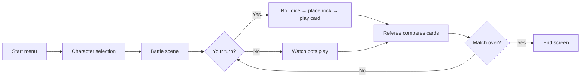

Beast Card Clash is a turn-based card strategy game for 1–4 players (one human, up to three AI bots). Each round, you roll a dice, place a token on the board, play a card from your hand, and watch the referee compare cards and deal damage. The last player standing wins.

This page walks you through a full match from the start screen to the end results.

## Match flow overview

## Step-by-step match guide

<Steps>
  <Step title="Launch from the start menu">
    When you open Beast Card Clash you land on the **start menu**. Press **Start** to begin a new match. From here the game takes you directly into character selection.
  </Step>

  <Step title="Pick your character and skin">
    The character selection screen shows playable animals. Each animal represents a species native to Colombia.

    **Available species and skins:**

    <AccordionGroup>
      <Accordion title="Bear" icon="paw">
        Six skins: `base`, `andean`, `black`, `grizzly`, `panda`, `polar`.

        The Andean Bear (Spectacled Bear) is native to Colombia's Andes mountains. Each skin is a visually distinct variant.
      </Accordion>
      <Accordion title="Chameleon" icon="eye">
        One skin: `base`.

        The Colombian chameleon offers a unique playstyle despite having a single skin option.
      </Accordion>
      <Accordion title="Condor" icon="feather">
        One skin: `base`.

        The Andean Condor — a national symbol of Colombia — takes to the skies as a playable character.
      </Accordion>
      <Accordion title="Frog" icon="leaf">
        Three skins: `base`, `green`, `perez`.

        The Perez's frog and its variants reflect Colombia's rich amphibian diversity.
      </Accordion>
    </AccordionGroup>

    Click a character on screen to select it. Once selected, you can cycle through its available skins using the **skin selector**.

    <Tip>
      Your skin choice is purely cosmetic — it does not affect stats or card draws.
    </Tip>
  </Step>

  <Step title="Choose your team (faculty)">
    After picking your character, select a **team**. Teams represent faculties of the Universidad Nacional de Colombia (UNAL).

    **Available teams:**

    <Columns cols={3}>
      <Card title="ACETILES" icon="flask" />
      <Card title="ADN" icon="dna" />
      <Card title="INGENIOSOS ELEMENTALES" icon="gear" />
      <Card title="PHOTO AGROS" icon="camera" />
      <Card title="PLUMA DORADA" icon="feather" />
      <Card title="RPC TEAM" icon="signal" />
      <Card title="REAL PINCEL" icon="paintbrush" />
      <Card title="VA GAMES" icon="gamepad" />
      <Card title="ZOOTECNICOS" icon="microscope" />
    </Columns>

    <Note>
      In the current version (0.1) team selection is cosmetic. Future updates may introduce team-specific card bonuses.
    </Note>
  </Step>

  <Step title="Enter the battle scene">
    After confirming your character, skin, and team, the game loads the **battle scene**. The match initialises:

    - All players (you and the AI bots) receive their starting decks.
    - Turn order is determined randomly.
    - If you go first, it is immediately your turn. If a bot goes first, you watch the bots play their turns before yours begins.

    <Note>
      A short dialogue sequence plays before the first round begins, introducing the match context.
    </Note>
  </Step>

  <Step title="Take your turn">
    When it is your turn, follow these three actions in order:

    **1. Roll the dice**

    Click the **dice** shown on screen. The 3D dice rolls and lands on a number. This number determines which **rocks** (positions on the board) are valid moves for this turn. Valid rocks are highlighted.

    **2. Choose a rock**

    Click one of the highlighted rocks to place your token there. Your choice of position can affect which cards are strong or weak in the upcoming comparison.

    **3. Play a card**

    After placing your token, your **hand of cards** appears. Click a card to play it. The card you choose will be compared against your opponents' cards by the referee at the end of the round.

    <Tip>
      Consider both the card's element and its power value when choosing which card to play. See [Cards](/mechanics/cards) and [Elements](/mechanics/elements) for strategic depth.
    </Tip>

    Once you play a card, your turn ends and the bots take their turns automatically.
  </Step>

  <Step title="Watch the bots play">
    During the **bot phase**, each AI opponent automatically rolls their dice, chooses a rock, and plays a card from their hand. You watch this play out in real time before the referee steps in.
  </Step>

  <Step title="Referee comparison">
    After all players have played a card, the **referee** compares every card played this round:

    - Cards are evaluated against each other based on their **element type** and **power value**.
    - Elemental type and card value both factor into the Referee's comparison — see [Elements](/mechanics/elements) for how elements are categorized.
    - The losing players take **damage** based on the outcome of the comparison.
    - A player whose health reaches zero is **eliminated** from the match.

    <Note>
      The referee phase is automatic. You do not need to do anything — just watch the results play out.
    </Note>
  </Step>

  <Step title="Continue or end">
    After the referee resolves damage:

    - If two or more players remain, a **new round** begins. Go back to the dice roll step.
    - If only one player remains, or the deck is exhausted, the match moves to the **end screen**.
  </Step>

  <Step title="End screen">
    The end screen displays the **final ranking** of all players and the match results. You can return to the start menu from here to play another match.
  </Step>
</Steps>

## Battle phases at a glance

| Phase | What happens |
|---|---|
| **Setup** | Players and bots initialised, decks assigned, turn order decided |
| **Your turn** | Roll dice → pick rock → play card |
| **Bot turns** | Each bot automatically rolls, picks, and plays |
| **Referee** | Cards compared, damage applied, eliminations checked |
| **End** | Rankings displayed, match complete |

## Tips for new players

<AccordionGroup>
  <Accordion title="Learn the elements before your first match" icon="fire" defaultOpen={true}>
    Beast Card Clash uses five elements: Air, Earth, Energy, Fire, and Water. Each element has strengths and weaknesses against others. Reading the [Elements](/mechanics/elements) page before you play will give you a big advantage over bots that play randomly.
  </Accordion>

  <Accordion title="Don't waste high-power cards early" icon="cards-blank">
    Your hand refreshes from a limited deck. Playing your strongest cards in round one can leave you with weak options later when opponents are still standing. Hold powerful cards for rounds where the advantage matters most.
  </Accordion>

  <Accordion title="Rock position matters" icon="circle">
    The rock you choose after rolling is not just cosmetic. Certain card effects and future mechanics interact with board position. Get into the habit of thinking about placement even if it feels optional at first.
  </Accordion>

  <Accordion title="Watch how bots play" icon="robot">
    AI bots follow consistent patterns. Pay attention to which cards they tend to play in early rounds. You can learn the element matchup system just by watching a few matches before trying to win.
  </Accordion>

  <Accordion title="Multiple skins, one playstyle" icon="paw">
    All skins for a given species play identically. Choose the skin you like visually — there is no mechanical difference between a Grizzly Bear and a Panda Bear.
  </Accordion>
</AccordionGroup>

## Learn more

<CardGroup cols={2}>
  <Card title="Cards" icon="cards-blank" href="/mechanics/cards">
    Full reference for card types, power values, and how cards interact.
  </Card>
  <Card title="Elements" icon="fire" href="/mechanics/elements">
    The five element types and how they shape your deck strategy.
  </Card>
  <Card title="Battle mechanics" icon="sword" href="/mechanics/battle">
    Deep dive into how the referee calculates damage and resolves ties.
  </Card>
  <Card title="Characters" icon="paw" href="/mechanics/characters">
    All species, skins, and teams.
  </Card>
</CardGroup>
