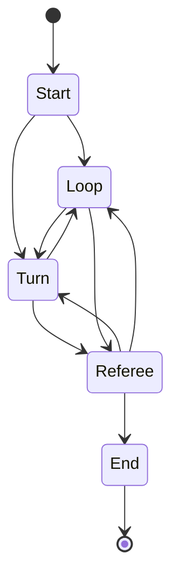

Every match in Beast Card Clash is governed by a five-phase state machine. Understanding how the phases connect gives you a clear picture of what happens each turn and why the order matters.

## State machine overview



The five states are **Start**, **Loop**, **Turn**, **Referee**, and **End**. Each state has a specific responsibility, and transitions between them are determined by whose turn it is and whether any turns remain in the current round.

## Phases in detail

### Start

The Start phase runs once at the beginning of every match. It prepares everything the battle needs before the first turn.

`BattleManager` handles setup through four methods called by `BattleStart`:

```gdscript battle_manager.gd
BattleManager.setup_player()  # Creates human Player, generates deck,
                              # connects deck_updated signal to battle UI
BattleManager.setup_bots()    # Creates 1 to MAX_PLAYERS-1 random bots,
                              # shuffles players array for turn order
                              # (MAX_PLAYERS = 4, so 1–3 bots)
BattleManager.setup_ui()      # Refreshes player stats, sets initial hand,
                              # hides end-game UI panel
BattleManager.setup_world()   # Disables dice interaction via BattleWorld
```

Turn order is randomized: `setup_bots()` shuffles the full `players` array so any participant — human or bot — may go first. After setup completes:
- If the human player goes **first**, the state machine transitions to **Turn**.
- If a bot goes **first**, the state machine transitions to **Loop**.

---

### Loop

The Loop phase runs whenever it is a bot's turn to act. The state machine automatically resolves bot actions without waiting for human input.

What happens in Loop:

<Steps>
  <Step title="Determine turn order">
    The state machine checks whose turn is next. If it belongs to a bot, Loop continues.
  </Step>
  <Step title="Roll dice for the bot">
    The bot's dice result is generated automatically — no animation is shown to the player.
  </Step>
  <Step title="Bot picks a rock">
    The bot selects a valid rock position based on its dice result.
  </Step>
  <Step title="Bot picks and plays a card">
    The bot selects a card from its hand and plays it.
  </Step>
  <Step title="Check for remaining turns">
    If more bots still need to act, Loop repeats. If the human player's turn is next, the state transitions to **Turn**. If no turns remain in the round, the state transitions to **Referee**.
  </Step>
</Steps>

---

### Turn

The Turn phase is your turn as the human player. Unlike Loop, Turn waits for your input at each step.

<Steps>
  <Step title="Roll the dice">
    Click the 3D dice on the board to roll it. The dice launches its flip animation and generates a random result between 1 and 6, then emits the `thrown_dice(number)` signal.

    ```gdscript dice.gd
    # Clicking the dice triggers:
    shuffle_dice()  # Launches animation, generates 1–6, emits thrown_dice(number)
    ```

    The dice's `clickable` property is managed by the battle UI — it is enabled at the start of your turn and disabled after you roll.
  </Step>
  <Step title="Select a rock">
    Valid rock positions are highlighted on the board based on your dice result. Click a highlighted rock to move your character there.
  </Step>
  <Step title="Play a card">
    Your hand is displayed. Click a card to select it — this emits `card_selected(card)` on the chosen `CardScene`. The card you select is registered as your play for this round.

    See [Cards](/mechanics/cards) for details on how card selection works.
  </Step>
  <Step title="Pass turn">
    After playing your card, your turn ends. The state machine transitions to **Loop** if any bots still need to act, or directly to **Referee** if all players have acted.
  </Step>
</Steps>

<Warning>
You must roll the dice before you can select a rock, and you must move to a rock before you can play a card. Skipping steps is not possible — the UI enforces this order.
</Warning>

---

### Referee

The Referee phase runs at the end of every round, after all players (human and bots) have played a card. This is where the round is resolved.

The Referee:

1. **Collects** all played cards from every player.
2. **Compares** them using the card's `element` and `value` properties.
3. **Applies damage** to players whose cards lost the comparison.
4. **Removes eliminated players** whose health drops to zero or below.
5. **Decides what comes next** — if players remain, the next round begins (transitioning back to **Turn** or **Loop**). If only one player survives, the game moves to **End**.

<Note>
The exact rules for how elemental types interact during comparison are handled entirely inside the Referee state. For the thematic description of each element, see [Elements](/mechanics/elements). For the full card data structure (element + value), see [Cards](/mechanics/cards).
</Note>

---

### End

The End phase displays the final ranking and results screen. It shows how each player finished — who won, who was eliminated, and in what order. From here the player can return to the main menu or start a new match.

## The dice

The interactive 3D dice is a central mechanic of your turn. Key properties:

| Property / Method | Description |
|---|---|
| `shuffle_dice()` | Launches the roll animation, generates a random integer (1–6), and emits `thrown_dice(number)` |
| `thrown_dice(number)` | Signal emitted with the result after the animation completes |
| `clickable` | Boolean — controls whether the dice responds to clicks. Managed by the battle UI |

The dice result determines which rocks on the board become valid landing positions for that turn.

## Player limits

```gdscript battle_manager.gd
const MAX_PLAYERS = 4  # 1 human + up to 3 bots
```

Every match has exactly one human player and between one and three AI bots. Bot decks are randomly generated at the start of each session.

## Related pages

<CardGroup cols={3}>
  <Card title="Cards" icon="cards-blank" href="/mechanics/cards">
    Understand the card data structure and how card selection works during Turn.
  </Card>
  <Card title="Elements" icon="fire" href="/mechanics/elements">
    Learn about the elemental types the Referee compares during resolution.
  </Card>
  <Card title="Battle state machine (dev)" icon="diagram-project" href="/dev/battle-state-machine">
    Technical deep-dive into BattleManager and the state machine implementation.
  </Card>
</CardGroup>
